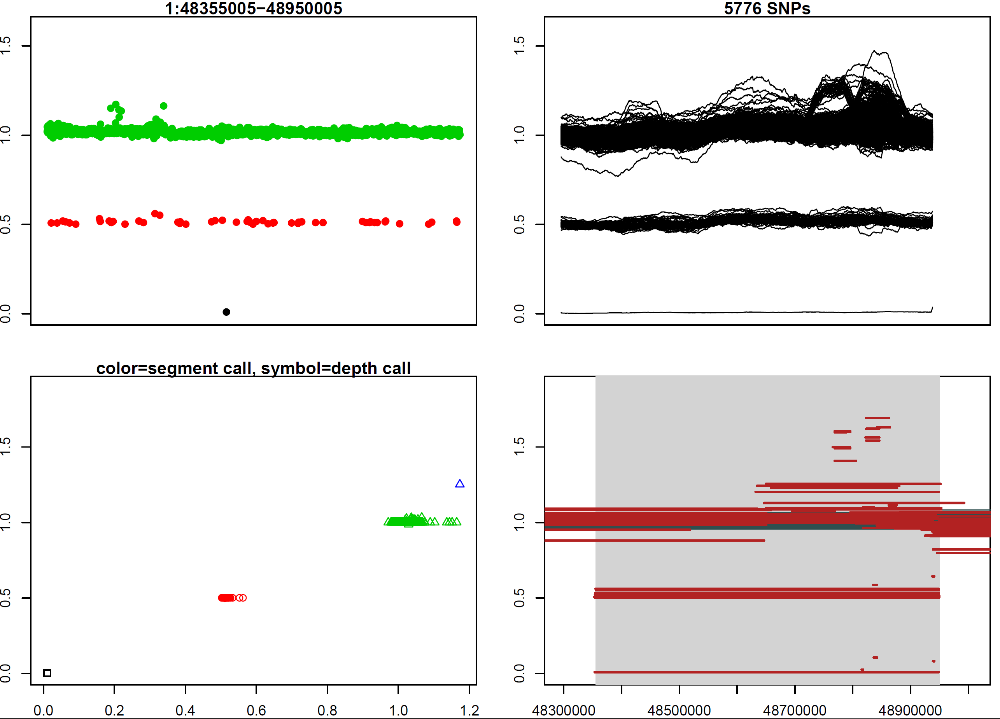
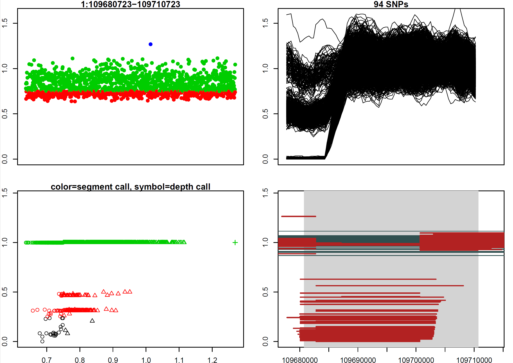
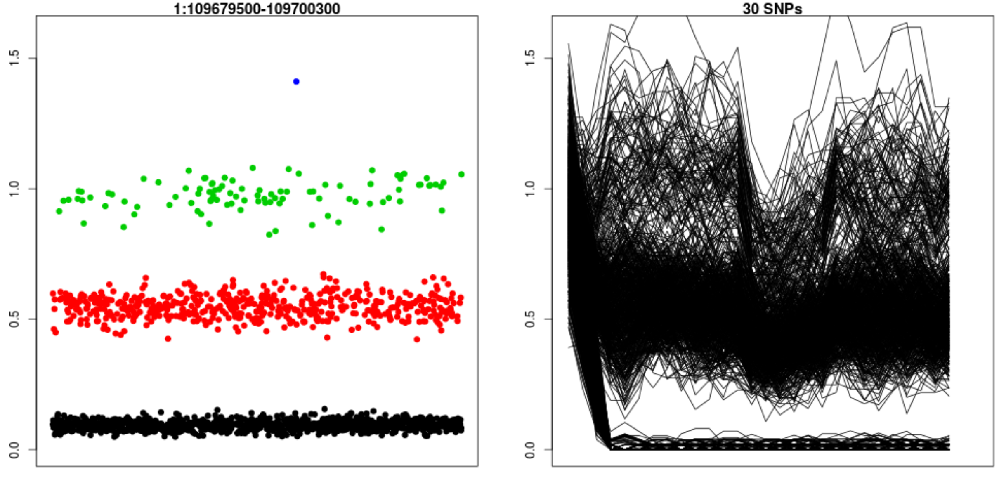

# UN-CNVc: the Unimaginatively-Named Copy Number Variant Caller

> We would like to thank the United Nations for serendipitously lending their name to our caller.

## Rationale
Unlike all of the CNV callers we know, `UN-CNVc` uses VCFs to call copy number variants. It requires high-depth (>10x, >20x is ideal) whole genome sequencing on at least 100 samples to work well. This input format makes it notably faster than alignment-based callers: it can process approximately 1 sample per second on a 10Mb chunk. This means that if you have access to ~150 processing cores for parallelisation, `un-cnvc` can process **1,000 samples in about 15 minutes**.

## Limitations
Due to the way it works, `un-cnvc` will not be able to genotype small events. Typically, sensitivity drops dramatically for events below 5-10kb in size, or events that are spanned by less than 50 SNVs.
Not only are small events more likely to be missed, they are also more likely to get genotyped wrong. The program uses two different genotyping algorithms, which both perform best in different cases. To help you make the decision, it generates a QC file which can help you decide which method to use. 

## Prerequisites
To run UN-CNVc, you will need :
* a recent (>v. 1.1) version of `bcftools`
* a recent (>v. 3.3) version of `R`
* the `mixtools`, `zoo`, `rpart` and `data.table` R libraries (`install.packages("mixtools")`, etc.)

## Installation
`un-cnvc` should work almost out-of-the-box: after checking out the file and making sure you have access to all dependencies above, please change the first line of `cnvc.R` to reflect the path of your local R interpreter.

## Usage

In version 1.1 the running process has been greatly simplified. First, generate per-chromosome depth files using `bcftools`. For example:

```bash
for i in {1..22}; do bcftools stats -s- chr$i.vcf.gz | grep ^PSC | awk '{print $3, $10}' > chr$i.avgdepth; done
```

After that, only 1 call is necessary:

```bash
./uncnvc --vcf [vcf.gz_file] --interval [interval_to_call] --depth-file [depth_file] --out [output_basename] --cp [complexity] --include-dups [include_dups] --method [method] [--no-genotypes]
```
* Options:
   * `-v|--vcf| [vcf.gz_file]` is a **bgzipped, tabixed VCF file** which contains `[interval_to_call]`. Currently only chromosome names prefixed with `chr` are supported.
   * `-i|--interval [interval_to_call]` is the genomic interval you wish to call depth in (we strongly advise using 10Mb windows). Can be written with or without the leading `chr`.
   * `-d|--depth-file [depth_file]` is the depth file generated by the call above. It is a headerless file, with two columns: sample ID and chromosome-wide average depth.
   * `-o|--out [output_basename]` is the base output name for all files.
   * `-c|--complexity [complexity]` is the complexity parameter passed to `rpart`. In practice, a value between 0.05 and 0.001 gives best results; please see below for how to tune this value.
   * `-u|--include-dups [0|1]` controls whether duplication-only events are called.
      * `0` calls only deletions and calls duplications the same as no CNV. This generates a PLINK `.ped/.map` dataset.
      * `1` calls duplications as well as deletions. This generates a PLINK CNV dataset (`.cnv`).
   * `-m|--method [segment|means|both]` is the genotyping method used. See below for a discussion. We advise to use `both`. Ignored if `-s` is set.
   * `-s|--no-genotypes` suppresses genotyping output, just produces diagnostics plots. Useful for tuning the `-c` parameter.

## Genotyping

`un-cnvc` provides two genotyping algorithms: segment-based, which used levels regressed using piecewise constant regression, and means-based, which uses piecewise constant regressions only to call CNV regions, but then uses average depth over these regions to genotype samples. The latter gives more accurate results in small regions, but is also less robust to errors in estimating event boundaries. We advise to use the QC plots produced in the output to choose the method that best fits any given event. 

## Output
* `[output_filename].[interval_to_call].alldp`. A (large) file which contains depth measurement for all samples at all markers in the region.
* `[output_filename].[interval_to_call].window.pdf`. A graph such as the one below:

   * The top left panel represents the piecewise constant relative depth intervals. There will be a cluster around 1, representing the normal depth. Horizontal dashed intervals represent expected locations of CNV segments (het/hom del or dup). Vertical highlighted regions are regions called as variants by UN-CNVc.
   * Top right panel is a histogram of the observed segment depths.
   * Bottom left panel represents the statistics used by the caller to call variable regions.
* `[output_filename].ped/.map` PLINK dataset. Produced when the duplicate flag is set to 0.
* `[output_filename].cnv` PLINK CNV dataset. Produced when the duplicate flag is set to 1. Currently PLINK support for this format is in beta status.
* `[output_filename].[interval_to_call].QC.pdf`. A PDF file containing for each called event in the interval, a graph such as the one below:

   * The top left panel represents average depth calls in the region, with depth calls shown as colors. A good graph has clearly defined clusters around multiples of 0.5 that each mostly contain 1 colour.
   * The top left panel shows rolling mean depths, per sample, in the region. Lines should be mostly horizontal (no slopes), and should be clustered around multiples of 0.5.
   * The bottom right panel represents piecewise constant intervals, with samples containing multiple intervals in the region coloured in red. Check that most non-REF intervals are about the same length and largely overlap.
   * The bottom left panel is a diagnostics plot comparing genotyping results from both methods. Ideally, results will be similar, meaning that `n` clusters of mostly identical colors and shapes should appear on the diagonal of the plot. For small events this will not be the case, though, and this plot should help you decide which method to use, or whether to discard this SV as part of your QC pipeline.

*  `[output_filename].[interval_to_call].genotypes.csv`. A comma-separated values file, with the following header:
   * `sample`
   * `chr` 
   * `start`
   * `stop`
   * **Rows relevant to segment-based genotyping:**
     * `segments` : number of segments in the region for that sample (a low number is a good sign)
     * `segment_weighted_depth` : depth of segments, weighted by their lengths
     * `segment_weighted_assigned_depth` : assigned depths of segments, weighted by their lengths
     * `segment_total_assigned_depth` : depth call for segment genotyping
     * `segment_weighted_pvalue` : weighted probability of call being true
   * **Rows relevant to means-based genotyping:**
     * `chrwide_depth` : chromosome-wide depth for that sample
     * `region_depth` : average depth for that sample in the CNV region
     * `means_assigned_depth` : depth call for means genotyping
     * `means_inverse_confidence` : One minus probability of call being true

## Tuning the complexity parameter

The complexity parameter is an argument passed to the regression tree method, which determines the increase in likelihood below which the model will stop trying to optimise the model further. A smaller value results in a better fit to the depth, in other words, a more erratic piecewise constant function. Smaller values increase sensitivity, but decrease specificity. Large values (such as the default 0.01) will give a low false positive rate but will only detect large events (~>50kb). More discussion on this topic can be found on the [documentation page](https://www.rdocumentation.org/packages/rpart/versions/4.1-13/topics/rpart.control) for the `rpart.control` method.

A good idea is to tune the parameter to your needs, by gradually lowering the parameter until it detects the deletion you are interested in. Common deletions to use for this are the _RHD_ and _GSTM1_ null mutations.

## Manual genotyper

In case you know the boundaries of your CNV and want to directly genotype them, we provide a manual genotyper. It is run as follows:

```bash
./direct.closest.R [alldp_file] [chrwide_depth_file] [outfile_base] [chr] [start] [end]
```

It allows the genotyping of very small deletions such as the _GSTM1_, which is too small for `un-cnvc` to detect automatically with correct boundaries:


The manual genotyper, in contrast, provides much better genotypes:


The manual genotyper only operates in `means` mode.
