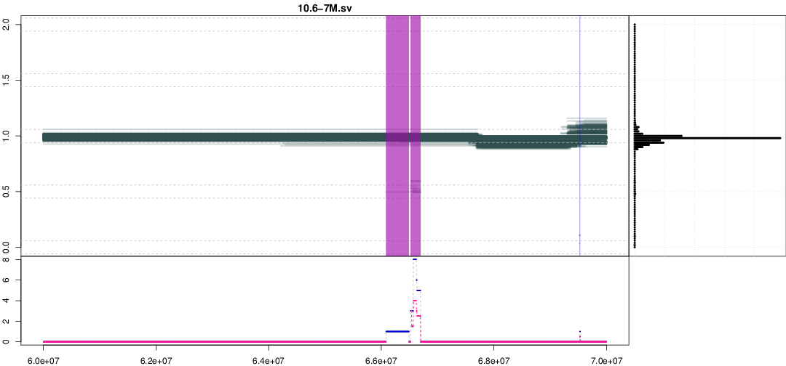

# UN-CNVc: the Unimaginatively-Named Copy Number Variant Caller

> We would like to thank the United Nations for serendipitously lending their name to our caller.

## Rationale
Unlike all of the CNV callers we know, `UN-CNVc` uses VCFs to call copy number variants. It requires high-depth (>10x, >20x is ideal) whole genome sequencing on at least 100 samples to work well. This input format makes it notably faster than alignment-based callers: it can process approximately 1 sample per second on a 10Mb chunk. This means that if you have access to ~150 processing cores for parallelisation, `un-cnvc` can process **1,000 samples in about 15 minutes**.


## Prerequisites
To run UN-CNVc, you will need :
* a recent (>v. 1.1) version of `bcftools`
* a recent (>v. 3.3) version of `R`
* the `mixtools`, `zoo`, `rpart` and `data.table` R libraries (`install.packages("mixtools")`, etc.)

## Installation
`un-cnvc` should work almost out-of-the-box: after checking out the file and making sure you have access to all dependencies above, please change the first line of `cnvc.R` to reflect the path of your local R interpreter.

## Usage

In version 1.1 the running process has been greatly simplified. First, generate per-chromosome depth files using `bcftools`. For example:

```bash
for i in {1..22}; do bcftools stats -s- chr$i.vcf.gz | grep ^PSC | awk '{print $3, $10}' > chr$i.avgdepth; done
```

After that, only 1 call is necessary:

```bash
./uncnvc --vcf [vcf.gz_file] --interval [interval_to_call] --depth-file [depth_file] --out [output_basename] --cp [complexity] --include-dups [include_dups] --method [method] [--no-genotypes]
```
* Options:
   * `-v|--vcf| [vcf.gz_file]` is a **bgzipped, tabixed VCF file** which contains `[interval_to_call]`.
   * `-i|--interval [interval_to_call]` is the genomic interval you wish to call depth in (we strongly advise using 10Mb windows).
   * `-d|--depth-file [depth_file]` is the depth file generated by the call above. It is a headerless file, with two columns: sample ID and chromosome-wide average depth.
   * `-o|--out [output_basename]` is the base output name for all files.
   * `-c|--complexity [complexity]` is the complexity parameter passed to `rpart`. See below for how to tune this value.
   * `-u|--include-dups [include_dups]` controls whether duplication-only events are called.
      * `0` calls only deletions and calls duplications the same as no CNV. This generates a PLINK `.ped/.map` dataset.
      * `1` calls duplications as well as deletions. This generates a PLINK CNV dataset (`.cnv`).
   * `-m|--method [method]` is the genotyping method used. See below for a discussion. We advise to use `both`.
   * `-s|--no-genotypes` suppresses genotyping output, just produces diagnostics plots. Useful for tuning the `-c` parameter.

## Output

* `[output_filename].stats`. A file with the following header, used to filter your CNVs:
   * `chr` 
   * `start`
   * `stop`
   * `hom` : number of homozygous deletions (depth=0)
   * `het` : number of heterozygous deletions (depth=0.5)
   * `normal` : number of samples with no variation
   * `dup` : number of samples with duplications (depth=k.0.5, with k>2)
   * `del_af` : frequency of deletion
   * `del_ratio` : ratio of deletions to duplications
   * `avg_del_p` : average confidence of the deletion calls
   * `del_hc` : number of high-confidence calls
   * `del_lc` : number of low-confidence calls (`confidence=5%` by default so low-confidence is really low confidence.)
   * `del_hc_total_ratio` : fraction of dels that are high-confidence 
   * `avg_dup_p` : average confidence of duplications
   * `dup_hc` : number of high-confidence duplication calls
   * `dup_lc`  : number of low-confidence dup calls
   * `dup_hc_total_ratio` : fraction of dups that are high-confidence
* `[output_filename].pdf` A diagnostics plot, used to visualise your results.

   * The top left panel represents the piecewise constant relative depth intervals. There will be a cluster around 1, representing the normal depth. Horizontal dashed intervals represent expected locations of CNV segments (het/hom del or dup). Vertical highlighted regions are regions called as variants by UN-CNVc.
   * Top right panel is a histogram of the observed segment depths.
   * Bottom left panel represents the statistics used by the caller to call variable regions.
* `[output_filename].ped/.map` PLINK dataset. Produced when `include_duplications=0`.
* `[output_filename].cnv` PLINK CNV dataset. Produced when `include_duplications=1`. Currently PLINK support for this format is in beta status.
